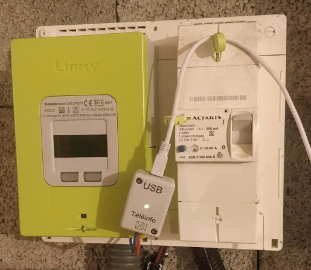
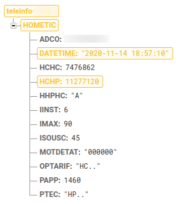

# TELEINFO PHP DAEMON

This PHP script permits to get [teleinfo](https://www.enedis.fr/sites/default/files/Enedis-NOI-CPT_54E.pdf) rawdata from an [Enedis](https://www.enedis.fr/) electricity meter like a [Linky](https://www.enedis.fr/linky-compteur-communicant).

To decode the frame, you'll need an USB module like the [USBTICLCV2](https://www.cartelectronic.fr/teleinfo-compteur-enedis/127-teleinfo-1-compteur-usb-lc.html) from Cartelectronic.

The script is intended to run as a Linux Daemon, you'll find a [systemd file](/teleinfo.service) in the source that you can reuse for this purpose.

This daemon reads continuously data from the electricity meter and sends them to a [Google Firebase Realtime Database](https://firebase.google.com/products/realtime-database).

Don't forget to add your `firebase-service-account.json` to authenticate to Firebase.\
Rename the `config.sample.php` into `config.php`. Set the constants to reflect your configuration.